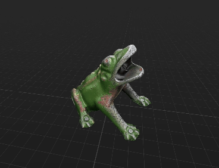

# Juego de la Rana

[Check out the official website](https://www.dc-engineer.com/juego-de-la-rana/)

[Join the beta test on iOS](https://testflight.apple.com/join/3b6ujPfg)

🐸 The Basque "Juego de la Rana" ("Igel Jokoa" in Euskera, or simply "Frog Game") is a popular tavern game where one must attempt to throw a metal disc into the mouth of a brass frog statue. 
Similar games exist elsewhere, replacing the word _rana_ (frog) with _sapo_ (toad) in South America, or the similarly-named "Toad in the Hole" in England.

🎯 In the Basque country, a simpler version of _La Rana_ is played, with a single, exceptionally difficult-to-hit target.
This is unlike other international variants with bridges, multiple-tiered chests, and other novelties.
No, in País Vasco a more basic version is preferred, dating back to the Iron Age and feudal systems of the time.

♘ "Juego de la Rana" symbolizes the strict and corrupt commercial practices characteristic of the time and place it was invented.
During the iron age in the Basque regions of the Iberian peninsula, the local feudal lord and his knights would levy charters on merchants who would pass, to ensure their safe passage over the roads, rivers, and bridges they controlled.
The extreme difficulty of successfully tossing a coin into the Frog's mouth was an allegory for the challenges of living in this system.

🍻 Today, _La Rana_ remains popular in Euskadi as a game that is played on street corners, in taverns, during festivals, and at home.
It is enjoyed by adults, children, locals, and _extranjeros_ alike.
While the objective is simple, the challenge of successfully hitting the target leads to intense satisfaction when achieved.

📱 This is an augmented reality (AR) version of "Juego de la Rana," allowing one to repeatedly flick a coin into a mouth of a virtual frog, from any location you choose.
When the game loads, you should first tap on the location in your environment where you want the board to be placed; usually a spot on the floor a couple to several meters away.
If you don't like the spot where the board appears, you may press the relocate button on the bottom, and use a single-finger drag, or double-finger twist, to position it to your preference.
Then "flick" a coin using an upward swipe on your screen.
Scores for the number of coins that hit the target, and the number that go inside the frogs mouth, are recorded.

| Click to watch a "Making of la Rana" video on YouTube                                                                                                  |
|--------------------------------------------------------------------------------------------------------------------------------------------------------|
|  |

## Photogrammetry

Recently, as the yearly festival of Aste Nagusia was wrapping up, I came across a La Rana setup with barely anyone else around (a rarity, the board in Casco Viejo is usually surrounded by dozens). 
I took the opportunity to gather sixty photographs of the board from all different angles.
These were then processed using Photogrammetry in XCode with RealityKit.
The resulting model in `.usdz` format turned out just about perfect, as can be seen in the animation. 

## Blender

## RealityKit and SwiftUI

## Attribution

Audio files for sound effects have been downloaded from [ZapSplat](https://www.zapsplat.com/).
